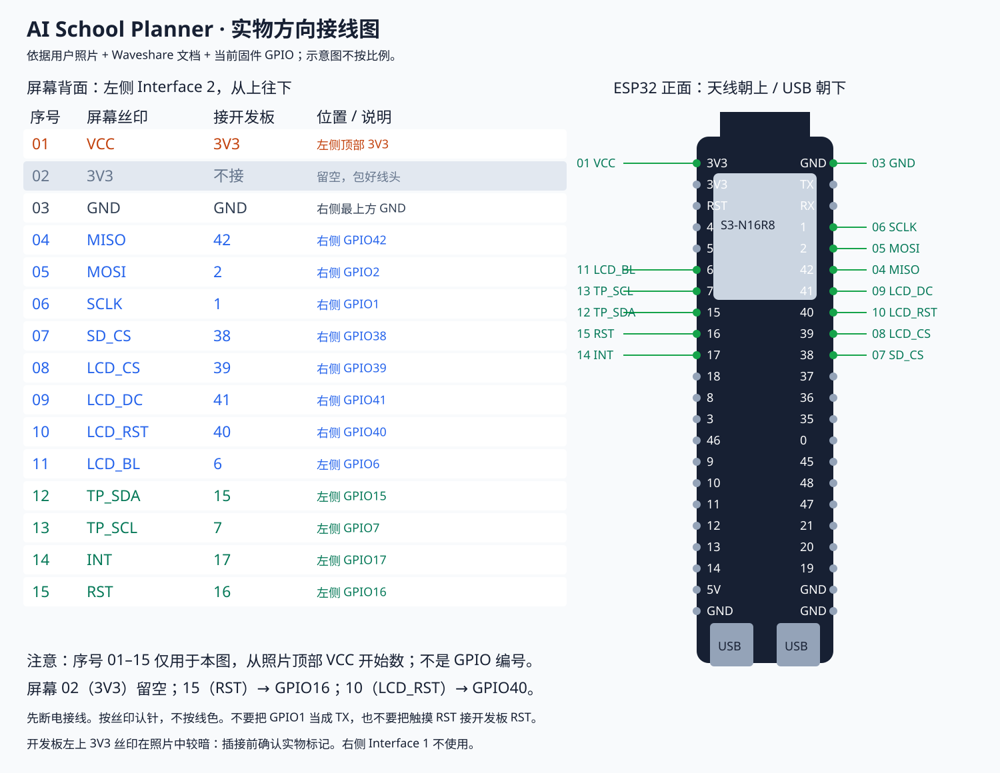

# ESP32-S3 家庭课表屏

首版固件已编译通过，尚未在实物上验证显示、触摸和网络。目标硬件：ESP32-S3 DevKitC-1 N16R8 + Waveshare 独立 3.5inch Capacitive Touch LCD（ST7796S / FT6336U）。不是 Waveshare 一体式 ESP32 显示板。

## 接线

断电接线。以下 GPIO 来自 Waveshare 对应 ESP32-S3 示例；请按屏幕背面信号名称连接，不按排线颜色猜测。

实物方向：屏幕背面文字朝上，使用左侧 Interface 2。下表按照片从上到下编号；开发板天线朝上、USB 朝下。编号仅用于定位，不代表 GPIO。



| 从上到下 | 屏幕丝印 | ESP32 接点 | 位置 |
| --- | --- | --- | --- |
| 1 | VCC | 3V3 | 左侧顶部 3V3 |
| 2 | 3V3 | 不接 | 留空，包好线头 |
| 3 | GND | GND | 右侧最上方 GND |
| 4 | MISO | 42 | 右侧 GPIO42 |
| 5 | MOSI | 2 | 右侧 GPIO2 |
| 6 | SCLK | 1 | 右侧 GPIO1 |
| 7 | SD_CS | 38 | 右侧 GPIO38 |
| 8 | LCD_CS | 39 | 右侧 GPIO39 |
| 9 | LCD_DC | 41 | 右侧 GPIO41 |
| 10 | LCD_RST | 40 | 右侧 GPIO40 |
| 11 | LCD_BL | 6 | 左侧 GPIO6 |
| 12 | TP_SDA | 15 | 左侧 GPIO15 |
| 13 | TP_SCL | 7 | 左侧 GPIO7 |
| 14 | INT | 17 | 左侧 GPIO17 |
| 15 | RST | 16 | 左侧 GPIO16 |

屏幕第二根 3V3 本方案不接，VCC 接开发板 3V3；不要额外连接两路电源。屏幕最下面 RST 是 TP_RST，接 GPIO16，不是开发板 RST。屏幕右侧 Interface 1 不使用。照片没有排线，无法据此确认各颜色对应的信号；以插头对应的丝印位置为准。

不使用 SD 卡，但保持 SD CS 为高电平。触摸采用轮询。横屏分辨率 480×320；方向需实物确认，必要时修改 include/board.h 的 TOUCH_FLIP_X / TOUCH_FLIP_Y。

官方参考：[产品 Wiki](https://www.waveshare.com/wiki/3.5inch_Capacitive_Touch_LCD)、[ESP32-S3 示例](https://files.waveshare.com/wiki/3.5inch%20Capacitive%20Touch%20LCD/3.5inch_Capacitive_Touch_LCD_Demo_ESP32S3.zip)。

## 编译与烧录

在仓库根目录运行（Windows PowerShell，需 Python）：

```powershell
python -m venv firmware/tools/venv
./firmware/tools/venv/Scripts/python.exe -m pip install -r firmware/tools/requirements.txt
node --env-file=.env.local firmware/tools/configure-device.mjs
./firmware/tools/venv/Scripts/pio.exe run -d firmware
./firmware/tools/venv/Scripts/pio.exe device list
./firmware/tools/venv/Scripts/pio.exe run -d firmware -t upload --upload-port COM5
```

将 COM5 换成实际端口。连接开发板的数据 USB 接口；若无法进入下载模式，按住 BOOT，按一下 RESET，再松开 BOOT。上传结束后按 RESET。上传命令自动写入 bootloader、分区表及应用；不要把单独 firmware.bin 写到地址 0。

项目覆盖为 16 MB Flash、OPI PSRAM（8 MB）；PlatformIO 的通用板名仍可能显示 N8。设备未检测到 PSRAM 会在屏幕显示错误。构建时从 certifi 筛选 Vercel 使用的可信 CA 根证书，避免完整证书集合耗尽 TLS 内存，不包含任何私人密钥。日后更新 certifi 并重新编译可更新证书。

生成配置命令从根目录 .env.local 读取 DEVICE_TOKEN，写入 Git 忽略的 firmware/include/secrets.h。构建输出也已忽略；含密钥的固件不得公开发布。更新设备密钥后重新生成、编译和烧录。

## 首次配置

1. 开机屏幕显示 SchoolPlanner 热点名称和本次随机 8 位数字热点密码。
2. 手机连接该热点，打开 http://192.168.4.1 。
3. 从扫描列表选择家庭 Wi-Fi，输入密码，保存后自动重启。可点击重新扫描刷新列表。

默认后端为 https://ai-school-planner-backend.vercel.app 。后端地址和 DEVICE_TOKEN 已预置到此设备固件，手机端无需填写；密钥不会返回给配置网页。无需学校密码、Supabase key、ADMIN_TOKEN 或 CRON_SECRET。支持 2.4 GHz Wi-Fi，配置页当前要求 8～63 字符的 Wi-Fi 密码。

配置保存在设备 NVS，普通重启无需重新输入。要换网络或设备密钥，在正常运行后长按 BOOT 3 秒重新进入配置。配置热点 10 分钟后关闭并重启；原配置只有在新配置保存时才覆盖。NVS 当前未启用 Flash 加密，能物理读取芯片的人可能提取配置。

## 操作与同步

- 默认明天；左滑下一天、右滑前一天。
- 上滑下一页课程、下滑上一页，每页 3 项；老师和教室直接显示。
- 启动时通过 NTP 校时，按英国夏令时转换 UTC。
- 每日英国时间 21:00 通过 HTTPS 获取 /api/device-snapshot，失败或云端尚未生成当天快照时，10 分钟后重试。
- 快照校验后写入 LittleFS；断网保留缓存，主缓存损坏时尝试备份。
- 显示数据来源、离线/过期/密钥错误，以及日期未同步状态。未覆盖日期不等于没有课。

断电后离线启动没有可靠时钟：显示 CLOCK UNVERIFIED，并从缓存起始日期的次日开始，联网校时后恢复明天。当前使用英文界面和内置拉丁字体，非拉丁字符显示问号；长文本省略。滑动到其他日期后保持选择，重启回到明天。

## 验证边界

已完成 PlatformIO 编译及后端接口测试。接线后仍需验证：屏幕方向/颜色、四个滑动方向、首次配网、TLS 连接、断网缓存、断电重启。尚未进行实机烧录或实现 OTA。

测试时可在根目录 .env.local 设置 WIFI_SSID / WIFI_PASSWORD（兼容 wifi / wifipass），运行 configure-device.mjs 后编译烧录。首次使用该预置配置会自动保存并联网；同一配置后续烧录不会覆盖通过手机修改的网络。更新环境变量并重新生成固件会应用新网络。所有凭据仅进入忽略的 secrets.h 和本地固件。

彩屏界面采用 iOS 风格浅灰背景、白色圆角卡片、彩色时间标签和分页圆点；顶部显示 Tiffin 官网校徽，不显示 ARBOR 字样；使用 Arduino_GFX 示例提供的 FreeSansBold10pt7b 字体。

当前实机 UI：暖白、墨灰、深绿配色；使用 Windows 本机 Segoe UI 生成灰度抗锯齿字形，字形头文件已 Git 忽略。重新构建前在有该字体和 Pillow 的 Windows 环境运行 `python firmware/tools/generate-fonts.py`。课程名 20px 粗体、老师 16px 常规体，默认每页 3 项。


## CrowPanel Advance 5-inch

Build environment: `crowpanel5` (ESP32-S3 N16R8, ST7262 RGB 800x480, GT911 touch).
The original `esp32s3` environment remains for the separate Waveshare 3.5-inch screen.

Generate private credentials with `node --env-file=.env.local firmware/tools/configure-device.mjs`.
Generate large fonts from the repository root with `python firmware/tools/generate-fonts.py --large` (Pillow required).
Build: `firmware/tools/venv/Scripts/pio.exe run -d firmware -e crowpanel5`.
Upload: add `-t upload --upload-port COM5` (check the actual port first).

Official wiring reference: https://github.com/Elecrow-RD/CrowPanel-Advance-5-HMI-ESP32-S3-AI-Powered-IPS-Touch-Screen-800x480/tree/master/example/V1.2_and_V1.3/Arduino/lesson-03/BigInch_LVGL
RGB clock 12 MHz (reduced from the vendor 16 MHz to leave PSRAM bandwidth for networking/animation); I2C SDA15/SCL16; GT911 address 0x5D; controller 0x30.
Uses official LovyanGFX wiring. I2C is kept at 100 kHz. Backlight is enabled again after RGB initialization using command 0x10, compatible with V1.1 and V1.2/V1.3; exact PCB revision remains unconfirmed.
Do not apply Waveshare GPIO reset/backlight commands to this integrated board.

Four courses per page, native-resolution antialiased fonts, horizontal date swipes and vertical page swipes.
School synchronization remains paused on Vercel; this device only reads previously saved snapshots.
Local full factory backup: `private/crowpanel-backup/factory-16mb.bin` (never commit).

Factory recovery (only for this backed-up unit, after checking the COM port):
`firmware/tools/venv/Scripts/python.exe firmware/.pio-core/packages/tool-esptoolpy/esptool.py --chip esp32s3 --port COM5 --baud 460800 write_flash 0 private/crowpanel-backup/factory-16mb.bin`
This restores the entire factory image and replaces planner settings/cache; it is not part of normal upload.

Serial diagnostics: `b` sends backlight 0x10, `B` sends 0, and `t` temporarily draws a white DISPLAY TEST screen. These commands do not access Arbor or alter credentials.
